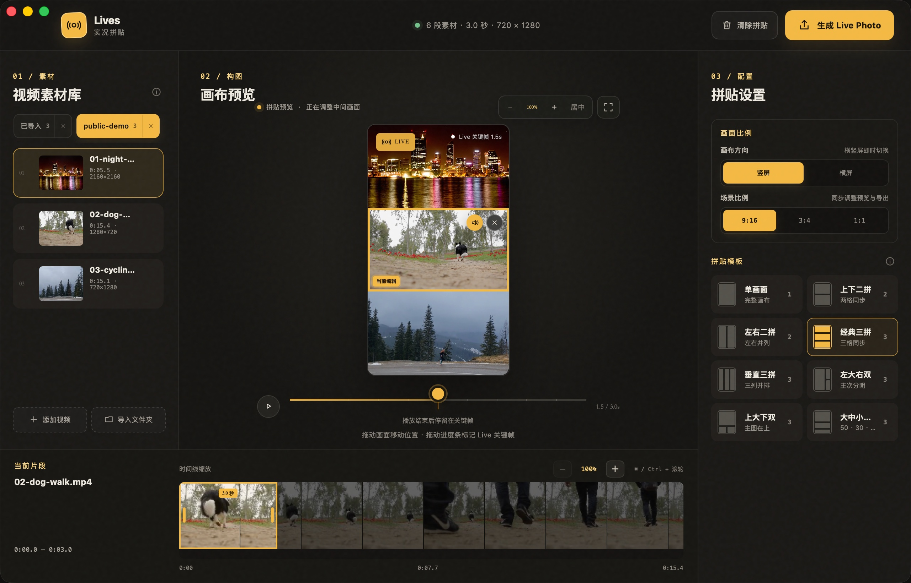

<<<<<<< HEAD
# Lives

**在 Mac 上，把视频里的多个瞬间拼成一张真正的 Live Photo。**

Lives 是一款面向 macOS 的本地实况拼贴工具。你可以从不同视频中分别截取 3 秒片段，组合成上下、左右或多画格布局，调整关键帧后保存到 Apple“照片”。

[产品官网](https://ohmyangboy.github.io/lives/) · [下载 Lives](https://github.com/ohmyangboy/lives/releases/latest) · [问题反馈](https://github.com/ohmyangboy/lives/issues)



> 画面来自真实 Lives 开发版，仅使用公开测试素材，不包含用户视频或个人信息。

## 它能做什么

- 从多个 MOV、MP4 或 M4V 视频中分别截取连续 3 秒；
- 提供上下、左右、三拼和大小画面等 8 种拼贴布局；
- 支持 9:16、3:4、1:1、4:3 和 16:9 五种画布比例；
- 每个画格都能独立选段、缩放、移动和开关原声；
- 自由选择 Live Photo 的封面关键帧；
- 保存到 Apple“照片”，或导出配对的 JPG 与 MOV 文件；
- 根据素材质量提供 1080P 或 720P 输出。

## 三步完成

### 1. 挑选瞬间

导入多个视频或一个文件夹，从每段素材里选择想保留的连续 3 秒。

### 2. 拼成画面

把素材拖入画格，选择布局和比例，再分别调整每个画格的位置与缩放。

### 3. 生成 Live Photo

设定封面关键帧和声音，预览同步效果，然后保存到“照片”或导出配对文件。

## 本地处理，素材不离开 Mac

Lives 不需要账号，也不会把导入的视频上传到服务器。应用直接引用原始文件进行本地处理，不会修改源视频。

只有在你主动选择“保存到照片”时，Lives 才会请求“仅添加照片”权限。应用不包含广告、用户行为分析或静默崩溃上报。

[阅读完整隐私说明](https://ohmyangboy.github.io/lives/privacy.html)

## 系统要求

- Apple Silicon Mac（M 系列芯片）；
- macOS 13 或更高版本；
- 当前为早期预览版本。

## 获取与支持

- 官网：[ohmyangboy.github.io/lives](https://ohmyangboy.github.io/lives/)
- 下载：[下载 Lives](https://github.com/ohmyangboy/lives/releases/latest)
- Bug 与功能建议：[GitHub Issues](https://github.com/ohmyangboy/lives/issues/new/choose)
- 私人问题与安全反馈：[ohmyangboy@gmail.com](mailto:ohmyangboy@gmail.com)

提交公开 Issue 前，请移除私人视频、照片、完整文件路径和未经脱敏的日志。

---

© 2026 ohmyangboy. Live Photos is a trademark of Apple Inc. Lives 与 Apple Inc. 无隶属或背书关系。
=======
# Lives MVP

Lives 是一个 macOS 本地工具：选择 1～3 段 MOV/MP4/M4V 视频，为每段选择连续 3 秒，以多种拼贴模板生成 Live Photo，并保存到 Apple“照片”或指定文件夹。

## 已实现

- 视频选择与 Finder 拖放，格式、时长和数量校验；
- 单画面、二拼和三拼模板；
- 每个素材独立的 3 秒选段与 0.1 秒步进；
- Canvas 循环预览、格子切换和裁剪中心拖动；
- Swift/AVFoundation H.264 多轨合成；
- JPEG 与 MOV 内容标识、still-image-time 元数据；
- `PHLivePhoto.request` 保存前校验；
- PhotoKit `.photo` + `.pairedVideo` 保存，以及 `.photoLive` 回查；
- 权限拒绝、取消、错误反馈和任务临时目录清理；
- 浏览器预览模式（不能写入“照片”）。

## 开发运行

需要 Xcode、Node.js 和 Rust。首次安装依赖后：

```bash
npm install
npm run tauri:dev
```

网页预览：

```bash
npm run dev
```

测试与构建：

```bash
npm test
swift test --package-path native/LivePhotoService
npm run tauri:build
```

## 真机验收

代码级自动测试不能替代平台链路验证。发布前至少完成：Mac“照片”显示一个 Live 资产并可播放；iCloud 同步到 iPhone 后保持 Live；在记录版本号的小红书 iOS App 中可选择、发布并回看。详见 [docs/真机验收记录.md](docs/真机验收记录.md)。

当前构建使用 ad-hoc 签名，未配置 Developer ID、公证或 App Sandbox，仅适合本机开发与内部测试。发布前应改用 Developer ID 签名并完成公证；如计划进入 Mac App Store，需要把 Swift 媒体层改为带独立 entitlement 的 XPC helper 后再启用 App Sandbox。
>>>>>>> 578d576 (feat: initialize Lives MVP)
