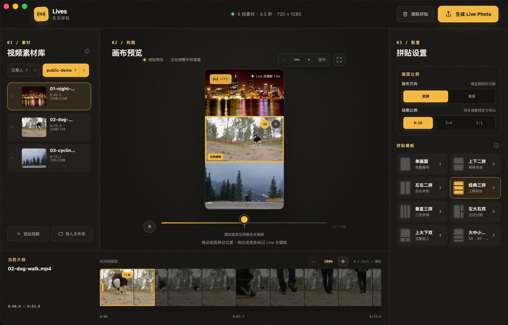

# Lives

> **Lives in lives** — Craft authentic Live Photos on your Mac by weaving multiple fleeting moments together.

[](https://github.com/ohmyangboy/lives/releases)
[](https://apps.apple.com/app/id6807655743)
[](https://github.com/ohmyangboy/lives/releases)
[](LICENSE)

[English](README_EN.md) · [简体中文](README.md) · [Official Website](https://lives.1leaf.cc/) · [GitHub Mirror](https://ohmyangboy.github.io/lives/) · [GitHub Releases](https://github.com/ohmyangboy/lives/releases) · [Mobile Site](https://ohmyangboy.github.io/lives-mobile-website/)

---

## Overview

Lives is a crafted collage suite dedicated to creating genuine Apple Live Photos, offering a native macOS desktop client alongside an iOS companion:

- **Lives for Mac**: **Free & Open Source**. A native macOS utility designed to transform video clips into iPhone Live Photos. Seamlessly trim fragments across multiple MOV, MP4, and M4V videos, dial in output durations from 1 to 15 seconds with precision keyframe controls, and sync directly to Apple Photos with 100% on-device processing.
- **Lives Mobile (iOS)**: **All fundamental features are completely open and free; advanced Pro capabilities are available via a one-time lifetime purchase** *(supporting the Pro plan is immensely appreciated!)*. A versatile live collage maker for iOS that reimagines how your clips come together on the go. Now officially available on the App Store.



> Screen capture taken directly from Lives in operation using royalty-free sample media. Contains no user footage or personal data.

---

## Core Philosophy

- 🔒 **100% On-Device Processing**: Local decoding straight from source files without cloud uploads. Your footage never leaves your Mac—zero accounts, zero remote libraries.
- ⏱️ **1–15s Flexible Duration**: Independently trim each segment with film cartridge & loupe keyframe controls; playback gently settles back to your cover frame.
- 📐 **8 × 5 Creative Matrix**: 8 curated collage layouts (split horizontal/vertical, triptych, picture-in-picture, etc.) across 5 popular aspect ratios (9:16, 3:4, 1:1, 4:3, and 16:9).
- 📷 **Authentic Live Photos**: Generates paired JPEG + QuickTime MOV assets infused with native Apple metadata, registering directly into your Photos library to preserve full motion across iCloud.

---

## Workflow: Three Simple Steps

Skip the steep learning curve of complex NLE editors. Media library, canvas, and timeline converge in a single, focused window:

1. **Pick (01 / PICK)**: Import videos or entire folders, trim selections, and drag edge handles along the timeline to dial in any duration between 1 and 15 seconds.
2. **Collage (02 / COLLAGE)**: Drag clips directly into grid cells. Re-use the same clip across different moments, scale/reposition independently, and toggle individual audio tracks.
3. **Motion (03 / MOTION)**: Select your signature cover keyframe, preview synced playback, and save straight to Apple Photos or export paired JPG + MOV files.

---

## Download & Availability

### iOS (Lives Mobile — Now on App Store)

**Lives Mobile** for iOS is now officially live on the App Store!

> 💡 **Licensing & Pricing**: macOS is completely free and open-source. On iOS, all fundamental features are fully accessible for free, with optional Pro enhancements unlocked via a one-time purchase (*your support for the Pro plan is deeply appreciated!*).

- 📲 **App Store**: [Download Lives Mobile on the App Store](https://apps.apple.com/app/id6807655743)
- 🌐 **Mobile Website**: [Visit Lives Mobile Website](https://ohmyangboy.github.io/lives-mobile-website/)

<a href="https://apps.apple.com/app/id6807655743" target="_blank" title="Download Lives Mobile on the App Store">
  
</a>

*Scan the QR code with your iPhone camera or click the image above to open the App Store.*

---

### macOS (Download & Installation)

The current stable release for macOS is [`0.1.16`](https://github.com/ohmyangboy/lives/releases/tag/v0.1.16). This release introduces film cartridge & loupe keyframe controls, flexible 1–15 second duration adjustments, end-frame padding for shorter clips, refreshed official branding, and quick access to Lives Mobile within the feedback panel.

#### Getting Started in Three Steps
1. **Download DMG**: Grab the Apple Silicon DMG from the [v0.1.16 Release Page](https://github.com/ohmyangboy/lives/releases/tag/v0.1.16) and verify the accompanying SHA-256 checksum.
2. **Drag to Applications**: Mount the DMG and drag Lives into your `/Applications` directory.
3. **Launch & Authorize**: Quit any previous instances and launch Lives from Applications (do not run directly from the mounted volume). When saving to Photos, grant the requested "Add Photos Only" permission.

See [Release Notes](docs/releases/0.1.16.md) and [Verification Log](docs/releases/0.1.16-verification.md).

#### Code Signing, Notarization & Security
- Every official build is signed with **Developer ID Application: Yonghao Yang (LGKLTGNTY2)** and stapled with **Apple Notary Service** approval.
- [GitHub Releases](https://github.com/ohmyangboy/lives/releases) is the only official distribution source. Please do not download binaries from unverified third-party mirrors.

#### Built-in Resilient Auto-Updates
Lives features a reliable in-app update pipeline:
- **Dual-Source Fallback**: Cold starts query our self-hosted update mirror first, gracefully falling back to GitHub Releases.
- **Background Verification**: Downloads happen silently in the background, strictly validating file size, SHA-256 hash, and cryptographic code signing identity with progress displayed via a sleek titlebar capsule.
- **Atomic Replacement**: Atomic rename on same-volume installations with automatic rollback, fallback to `ditto` across volumes, and graceful degradation to `~/Applications` if system directories are read-only.
- **Watchdog Protection**: Guarded by strict timeouts across checking, downloading, and exiting phases to eliminate perpetual stalls.
- **Audit Log**: Diagnostic trace is persistently logged to `~/Library/Caches/com.yangbukun.lives/Updates/relaunch.log`.

---

## Privacy First: Local is the Boundary

**Local is our boundary.**
- **Zero Cloud Uploads**: Source files are parsed and rendered directly on device; originals are never altered. No accounts, no cloud dependencies.
- **Minimal Permissions**: Prompts only for "Add Photos Only" access when explicitly writing to Photos; your broader library remains entirely untouched.
- **No Telemetry or Tracking**: Free from commercial advertising trackers, user behavior analytics, and silent crash telemetry.
- **Clean Exit**: Working cache and temporary assets are automatically purged upon task completion or app exit.

[Read Full Privacy Policy](https://ohmyangboy.github.io/lives/privacy.html)

---

## Project Documentation & Architecture

### Documentation
- [PRD (MVP Requirements)](docs/项目文档/PRD-MVP.md)
- [Development Plan & Acceptance Checklist](docs/项目文档/开发计划与验收清单.md)
- [Architecture & Technical State](docs/项目文档/技术现状与架构.md)
- [Hardware Verification Log](docs/真机验收记录.md)

### Repository Structure
This repository hosts both the macOS desktop application and the official website. The core engine resides in `packages/LivesCore` as an internal module:
- `src/`: React / TypeScript client interface
- `src-tauri/`: Rust host and native bridge
- `native/LivePhotoService/`: Swift Helper (Photos library interaction and low-level synthesis pipeline)
- `packages/LivesCore/`: Media processing, 3D model loaders, and rendering engine
- `website/`: Official website source ([lives.1leaf.cc](https://lives.1leaf.cc/))
- `release/`: Historical release notes, verification reports, and checksum manifests
- `docs/`: Reference documentation for development, release workflows, and licensing

---

## Development & Build

### Prerequisites
- macOS 13+
- Xcode
- Node.js (v18+)
- Rust (1.80+)

### Local Development
```bash
# Install dependencies
npm install

# Start macOS desktop client in development mode
npm run tauri:dev

# Run frontend-only web preview
npm run dev
```

### Verification & Testing
```bash
# Frontend Vitest test suite
npm test

# Internal Core and Swift Helper test suites
swift test --package-path packages/LivesCore
swift test --package-path native/LivePhotoService

# Signing and pipeline verification
bash scripts/test-photo-signing.sh

# Production build
npm run tauri:build

# Website production build
npm run website:build
```

---

## Feedback & Community

- **Public Feedback**: For bugs and feature requests, please open a [GitHub Issue](https://github.com/ohmyangboy/lives/issues/new/choose) (please remove any private footage, personal info, or unredacted logs before submitting).
- **Direct Contact**: For private inquiries or security reports, email [ohmyangboy@gmail.com](mailto:ohmyangboy@gmail.com).
- **Sponsorship**: Lives is independently developed and open-sourced. If it helped preserve your cherished moments, consider supporting ongoing development via WeChat Pay:


---

## License & Legal

- **macOS Version**: Licensed under [GNU General Public License v3.0](LICENSE) (GPL-3.0-only) as completely free and open source. Historical public releases remain under their respective terms. For details, see [Licensing Boundaries](LICENSING.md) and [Third-Party Notices](THIRD_PARTY_NOTICES.md).
- **iOS Version**: Fundamental features are completely open and free; advanced Pro features are available through a one-time purchase.

*Live Photos is a trademark of Apple Inc. Lives is an independent project and is not affiliated with or endorsed by Apple Inc.*
