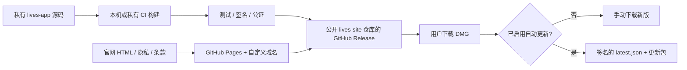
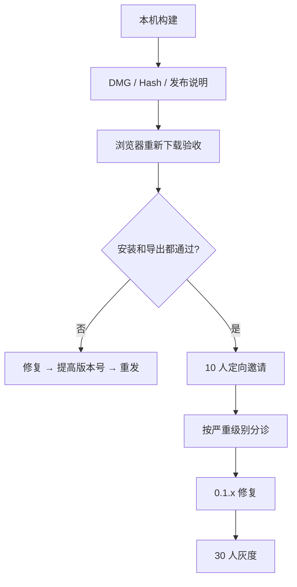

# Lives 独立分发全流程 SOP（GitHub Pages + GitHub Releases）

> 适用：Lives 的 macOS 独立分发；不提交 Mac App Store；产品源码保持私有。
>
> 更新：2026-07-21。本文是产品和工程操作指南，不构成法律、税务或商标代理意见。
>
> **状态：历史草案。** 已由 [Lives 独立分发最终计划](./Lives-独立分发最终计划.md) 取代；后续执行以最终计划为准。

## 先给结论：你现在该怎么走

最合适的路线不是“不上架就直接把 DMG 挂出来”，而是分两段：

1. **现在**可做 10～30 人的邀请制预览：GitHub Pages 展示官网，GitHub Releases 放 DMG、SHA-256 和发布说明；用户手动更新。当前包是 ad-hoc 签名，必须在官网醒目说明“未公证”，不能面向普通用户大规模推广或承诺自动更新。
2. **公开推广前**加入 Apple Developer Program，使用 **Developer ID Application** 签名并完成公证（notarization）；随后再接入 Tauri Updater。此路线不涉及 App Review 或上架 Mac App Store，但能让 Gatekeeper 正常识别软件。Apple 明确说明：直接分发的 Mac 软件应使用 Developer ID 签名并进行公证；公证不是 App Review。[Apple：Developer ID](https://developer.apple.com/support/developer-id/)

你不需要为了官网而公开应用源码。推荐维护两个仓库：私有的 `lives-app`（源代码、证书流程、CI）与公开的 `lives-site`（官网、法律文本、Release 资产）。公开仓库的 tag 源码压缩包只会包含官网，不会暴露私有应用源码。

## 1. 当前项目的实际状态

| 项目 | 当前状态 | 处理决定 |
| --- | --- | --- |
| 支持平台 | Apple Silicon、macOS 13+ | 官网和 Release 标题必须写清；不要暗示支持 Intel。 |
| 安装包 | 已产出 `.dmg` | 可用于小范围预览。 |
| 签名 | `signingIdentity: "-"`（ad-hoc） | 只能灰度；首次启动会被 Gatekeeper 拦截。 |
| 公证 | 未配置 | 公开推广前完成。 |
| 官网 | 已有静态站、隐私/条款/开源声明、Pages 工作流 | 可直接部署至公开站点仓库。 |
| 自动更新 | 未配置 | 在 Developer ID + 公证之后做。 |
| 用户数据 | 本地处理、无账号/分析/自动崩溃上报 | 保持这个最小化隐私边界。 |
| 软著 | 未登记 | 不是首发前置；功能冻结后并行申请。 |

## 2. 目标架构



**仓库边界是第一道安全线。** `lives-site` 只放：`website/` 静态站、公开截图、隐私/条款、Release notes、hash、安装帮助。绝不把 `src-tauri/`、产品源代码、`.p12`、Apple API key、Tauri 更新私钥或用户日志推上去。

## 3. 一次性准备（发布前 1 天）

### 3.1 账户与所有权

- 建一个公开 GitHub 仓库，例如 `your-name/lives-site`；主页和 Release 都在这里。
- 产品源码留在当前私有仓库。不要以“Release 仓库”为由将私有仓库改为公开：公开仓库可下载其完整 Git 历史。
- 注册一个产品域名；先只配置 `www.example.com` 到 GitHub Pages 的 CNAME。GitHub 建议同时使用 `www` 与根域；`www` 对 GitHub IP 变化更稳定。[GitHub Pages 自定义域名说明](https://docs.github.com/en/pages/configuring-a-custom-domain-for-your-github-pages-site/about-custom-domains-and-github-pages)
- 建一个产品专用邮箱，例如 `support@你的域名`。不要把个人私人邮箱直接写进应用。
- 开启 GitHub 账号双重验证；至少一位备用管理员；保存 recovery codes。

### 3.2 名称、权属与开源策略

先做名称检索，再公开推广：`Lives` 是常用英文词，检索中国商标第 9 类（可下载软件）、42 类（软件服务）以及域名、GitHub 组织名和主要社媒账号。不要宣称“Apple 认证/官方”；`Live Photos` 是 Apple 商标，保留“与 Apple 无隶属或背书关系”的声明。

**你需要先选清楚路线，不要处于“公开仓库但没有许可证”的灰区。** GitHub 上没有 `LICENSE` 不等于开源：默认仍保留版权，别人只能查看和 fork，不能获得清楚的再分发/修改授权。[GitHub：为仓库选择许可证](https://docs.github.com/en/repositories/managing-your-repositorys-settings-and-features/customizing-your-repository/licensing-a-repository)

| 你的目标 | 推荐策略 | 首发要做的事 |
| --- | --- | --- |
| 先验证产品、保留未来商业选择 | **核心源码私有**（推荐） | 公开官网、二进制、问题跟踪；提供 EULA/条款和 `THIRD_PARTY_NOTICES`。 |
| 想建立开发者社区、欢迎复用/贡献 | **Apache-2.0 + 商标/Logo 保留** | 放 `LICENSE`、`NOTICE`、`CONTRIBUTING.md`、`SECURITY.md`，贡献采用 DCO 或 CLA；官方二进制仍仅由你签名发布。 |
| 只想展示而非允许复用 | source-available（需自定义许可） | 不使用“开源”表述，找律师审阅许可。 |

对 Lives 目前的阶段，我建议核心代码私有、官网和文档公开；若你明确想通过开源获客，则选择 Apache-2.0 而不是临时不放许可证。Apache-2.0 有明确专利授权与 NOTICE 机制，较适合有贡献者的项目。无论哪条路线，都保留 `Copyright`、维护第三方许可证/NOTICE、锁定依赖、为每个 Release 保存 SBOM 或依赖清单。当前网站已有第三方声明，正式发布前再做一次传递依赖许可复核。

若以后决定开源，先选择清晰边界（例如官网、模板或非核心工具），再选许可证：

- 希望允许广泛复用：MIT；
- 希望保留专利授权和 NOTICE 要求：Apache-2.0；
- 希望衍生网络服务也开放：AGPL（商业合作阻力更高）。

无论是否开源，都要：保留 `Copyright`、维护第三方许可证/NOTICE、锁定依赖、为每个 Release 保存 SBOM 或依赖清单。当前网站已有第三方声明，正式发布前再做一次传递依赖许可复核。

## 4. 现在就能执行的最简首发 SOP（邀请制预览）

### Step 1 — 准备不可变的 Release 资产

对 `0.1.0`，Release 只应包含：

```text
Lives_0.1.0_aarch64.dmg
Lives_0.1.0_aarch64.dmg.sha256
release-notes.md
```

在构建机执行并记录结果：

```bash
shasum -a 256 Lives_0.1.0_aarch64.dmg
hdiutil verify Lives_0.1.0_aarch64.dmg
codesign --verify --deep --strict --verbose=2 Lives.app
```

`SHA-256` 不是签名的替代品，但能让用户和你自己确认下载包没有被替换。不要覆盖已发布的同名资产；发现问题一律发布更高版本（如 `0.1.1`）。GitHub Release 是围绕 Git tag 的可下载软件迭代单元。[GitHub Releases 文档](https://docs.github.com/en/repositories/releasing-projects-on-github/about-releases)

### Step 2 — 部署 GitHub Pages 官网

1. 把 `website/` 内容推送到公开 `lives-site` 仓库的 `main`，确认没有应用源码和密钥。
2. 仓库进入 **Settings → Pages**，将 Source 选为 **GitHub Actions**。
3. 在 **Settings → Secrets and variables → Actions → Variables** 配置：
   - `LIVES_VERSION=0.1.0`
   - `LIVES_DOWNLOAD_URL=https://github.com/<owner>/lives-site/releases/latest`
4. 运行现有 `Deploy Lives website to Pages` 工作流；打开 Pages URL，逐页检查首页、隐私、条款、第三方声明。
5. 若有域名，在 **Settings → Pages → Custom domain** 填 `www.example.com`，再到 DNS 服务商添加 GitHub 提示的 CNAME。DNS 生效后勾选 **Enforce HTTPS**。

官网首页下载区域必须同时写出：**Apple Silicon、macOS 13+、预览版、未公证、无自动更新**。不要隐藏 Gatekeeper 提示；只链接 Apple 官方“仍要打开”流程，不建议用户关闭 Gatekeeper 或运行绕过命令。

### Step 3 — 创建 Release

1. 打开公开仓库 **Releases → Draft a new release**。
2. 创建 tag `v0.1.0`；标题写 `Lives 0.1.0 — 独立分发预览版`。
3. 粘贴标准化 release notes（新增、修复、系统要求、已知问题、hash、反馈链接）。
4. 上传 DMG 和 `.sha256`；发布后回到官网确认下载按钮指向它。
5. 把本次 tag commit、DMG、hash、Release URL、页面截图保存至私有发布归档。

### Step 4 — 真实验收后再邀请用户

在**未用过该 App 的 Mac 或全新 macOS 用户账户**完成完整链路：从官网浏览器下载 → 比对 hash → 挂载 DMG → 拖进 Applications → 按正常 Gatekeeper 流程打开 → 导入视频 → 保存至照片/文件夹 → 如适用再验证 iPhone/iCloud。

只有这套真实路径通过，才邀请首批用户。首批邀请 10 人，覆盖 macOS 13/14/15、不同 Apple 芯片、iCloud 照片开启/关闭；目标不是下载量，而是找到安装拦截、首次导出失败和素材兼容性问题。



## 5. 用户反馈、诊断与支持（首发必须有）

不要只放一个“有问题联系我”。建立一个可分诊的入口：

| 渠道 | 用途 | 规则 |
| --- | --- | --- |
| GitHub Issues | 可复现 bug、安装失败 | 开启 Issue template，必填版本、macOS、芯片、步骤、预期/实际结果；明确禁止上传原始私密视频。 |
| GitHub Discussions | 使用问题、功能建议 | 用 Q&A / Ideas 两类；避免把提议和 bug 混在一起。 |
| support 邮箱 | 隐私、无法公开的问题 | 自动回复说明收件时间与“不发送原视频/个人照片”。 |
| App 内“复制诊断信息” | 用户主动附带环境信息 | 默认只含版本、系统、芯片、错误码和脱敏日志；用户先预览再自行粘贴，不自动上传。 |

给 Issue 设置 `bug`、`install`、`export`、`privacy`、`needs-info`、`known-issue`、`p0/p1/p2` 标签。每周固定一次分诊；P0（无法启动、数据风险、隐私问题）先止损、下线下载或发布修复。不要承诺 7×24 小时支持。

**崩溃上报的顺序：** 0.1.x 先不接入任何静默第三方遥测。等真实问题无法靠用户诊断定位时，再选择一个服务，并在上线前补充隐私政策、收集字段、保留期、第三方接收方、关闭方式和明确同意。视频路径、文件名、原始媒体、照片库内容都不应自动上传。

## 6. 从预览版升级为正式独立分发（公开推广前）

### 6.1 Apple Developer ID 签名与公证

这一步与 Mac App Store 上架无关，但对用户信任至关重要。加入付费 Apple Developer Program 后，由 Account Holder 创建 **Developer ID Application** 证书；免费账户无法为直接分发软件完成公证。[Tauri macOS 签名指南](https://v2.tauri.app/distribute/sign/macos/)

你的应用含主应用、Swift Helper 和 sidecar，必须确保所有嵌套可执行文件都被正确签名。Apple 对直接分发的公证要求包括：Developer ID、Hardened Runtime、安全时间戳、有效 entitlements，且不能保留 `get-task-allow`。[Apple 公证要求](https://developer.apple.com/documentation/security/notarizing-macos-software-before-distribution)

执行顺序：

1. 在 macOS 钥匙串安装 `Developer ID Application` 证书；只在私有构建环境或受保护 CI 使用。
2. 将当前 Tauri 配置从 `"signingIdentity": "-"` 改为 Developer ID identity；不要把证书名、`.p12` 或密码写进仓库。
3. 构建 DMG，验证嵌套代码签名；用 `spctl` 在干净机器测试。
4. 通过 `notarytool` 或 Tauri 的 Apple 凭据环境变量提交公证；检查每一条 notary log 警告/错误。
5. 对分发外层 DMG 执行 stapling；再从浏览器下载一次验证。Apple 建议 stapling，这样离线场景也能发现公证票据。[Apple 公证工作流](https://developer.apple.com/documentation/security/customizing-the-notarization-workflow)
6. 只有验收通过，才把官网从“未公证预览版”改为“已签名并公证”。

**Lives 当前的特有工程阻塞项：** `scripts/build-sidecar.sh` 会把 `live-photo-service` sidecar 和 `LiveCollagePhotosHelper.app` 用 `codesign --sign - --timestamp=none` 进行 ad-hoc 签名；Helper 也是 arm64 thin binary，未启用 Hardened Runtime。正式路线必须先改造该脚本和构建顺序：分别为 sidecar/Helper 使用 Developer ID 签名、Hardened Runtime 与时间戳，再由 Tauri 对主应用签名；签名后不可再改动任意嵌套文件。否则只给外层 `.app` 或 DMG 签名仍会导致公证失败或运行时校验问题。

证书、Apple API key、app-specific password 和 CI keychain password 都是高敏感密钥：放 GitHub Actions Secrets 或专门密码管理器，至少保留一份受控离线恢复副本；不要发送到 Issue、聊天记录或普通 `.env` 文件。

### 6.2 发布 CI/CD（在签名跑通后自动化）

先手动做一版正式签名/公证，成功后再自动化。建议触发器是受保护分支上的 `v*` tag：

1. 读取 tag，校验 `package.json`、`tauri.conf.json`、`Cargo.toml`、Helper 的版本一致。
2. 运行前端、Rust/Swift 测试与构建。
3. 在 macOS runner 导入临时 keychain，签名 → 公证 → staple。
4. 运行 DMG、codesign、spctl、hash 验证。
5. 生成 Release notes、SBOM/第三方许可证清单、hash。
6. 仅在所有验证通过后发布到公开 Release；失败时不创建“latest”。
7. 部署官网，并将官网版本/下载链接与 Release 精确一致。

GitHub Actions 可以保存密钥，但它不是唯一备份；给 production environment 加审批、限制谁能推 tag/改 release 工作流，并对 `main`/`release` 设 branch protection。

## 7. 自动更新：何时做、如何不把安全性做坏

**现在不要做。** ad-hoc 包 + 自动更新会把用户对更新包的信任风险放大。完成 Developer ID、公证和 30 人稳定灰度后再接入。

Tauri Updater 不是“检查 GitHub 最新 Release 就下载”这么简单：它要求更新产物使用独立私钥签名，客户端内置公钥验证；这项校验不能关闭。丢失私钥会导致已安装用户无法继续接收新更新。[Tauri Updater：签名与私钥要求](https://v2.tauri.app/plugin/updater/)

### 最小安全架构

```text
公开：latest.json、Lives.app.tar.gz、Lives.app.tar.gz.sig
应用内：Tauri updater 公钥、HTTPS endpoint
私有：Tauri updater 私钥及密码、Apple 签名证书、Apple 公证凭据
```

步骤：

1. 用 `tauri signer generate` 生成**专用**更新密钥；把私钥放密码管理器和加密离线备份，公钥写进 Tauri 配置。
2. 安装 Rust 与前端 updater plugin，开启 `createUpdaterArtifacts: true`；macOS 会产生 `.app.tar.gz` 与 `.sig`。
3. endpoint 可先用 GitHub Release 的静态 `latest.json`，但生产必须为 HTTPS；Tauri 生产模式强制 TLS。不要开启 `dangerousInsecureTransportProtocol`。
4. 只在用户主动点击“检查更新”或明确授权的启动检查后下载；展示版本、体积、变更日志、下载进度和“稍后安装”。
5. 先建 `beta` 通道，连续两版稳定后再进 `stable`；保留手动 DMG 下载和回退说明。
6. 演练私钥丢失、错误发布、证书吊销和 CDN/GitHub 不可用的应急预案；私钥一旦泄露，视为安全事件，停止发布并评估迁移方案。

## 8. 软件著作权、商标、隐私与中国大陆可用性

### 软件著作权

软件著作权随开发完成产生；登记不是下载分发的前置审批，但证书有利于权属举证、合作和部分平台业务。功能冻结后即可并行办，不必等公证完成。

材料核心是：申请表、身份证明、程序鉴别材料、文档鉴别材料与权属证明。国家版权局规则要求通常提交源程序和一种文档各前/后连续 30 页；不足 60 页则全部提交；受理后登记机构应在 60 日内审查完成。[《计算机软件著作权登记办法》](https://www.ncac.gov.cn/xxfb/flfg/bmgz/202410/P020241015604759788122.pdf)

你的操作清单：

- 确定权利人（个人或公司）及所有合作/外包/素材授权；有共同开发者先签权属确认。
- 名称、版本、作者署名在申请表、说明书、软件关于页、截图、DMG、Release 中保持一致，例如 `Lives 实况拼贴软件 V0.1.0`。
- 生成用户手册（功能、环境、安装、主要界面截图）；从私有代码导出合规的 60 页鉴别材料，保留导出日期和 Git commit。
- 保存 Git 历史、tag、构建日志、hash、首发网页截图、设计源文件。这些也比单一证书更能证明时间线。

软著保护代码表达，不排他保护“把视频拼成 Live Photo”的产品想法；品牌则要靠商标检索/申请和持续使用证据。

### GitHub Pages 与中国大陆

GitHub Pages 是境外托管。只要网站仍部署在境外，通常不走中国大陆接入商的 ICP 备案流程；代价是中国大陆访问和 GitHub 下载链路可能有波动。**不要把“GitHub Pages 能访问”当作 SLA。**

若将官网/下载迁到中国大陆服务器或 CDN，先向接入商确认主体、域名实名和备案要求，再按其流程完成 ICP；正式联网后还可能涉及公安联网备案。付费经营、收集大量个人信息、引入账号/云端内容、面向特定行业时，先让中国合规律师或当地服务商按你的主体与业务模式复核。

建议路线：首发保留 GitHub Pages；当大陆用户量证明需要时，再增加一个可控镜像下载源/国内托管站，不要在未签名更新机制中做静默下载源切换。官网所有渠道指向同一官方域名和 Release 页面，降低钓鱼包风险。

### 隐私与条款最低线

现有隐私页的“本地处理、无账号、无分析、照片仅添加”是正确的基础。每次新增以下任一项，都先更新隐私政策并在功能启用前告知：分析 SDK、自动崩溃日志、邮箱订阅、反馈表单、云同步、在线更新检查、支付。

隐私页至少写明：收集什么/不收集什么、用途、保存期、第三方（GitHub Pages/Releases）、联系渠道、删除/更正方式、政策生效日期。条款至少写清授权范围、系统要求、测试版已知限制、第三方服务、禁止行为、免责边界、更新/停止、联系方式。付费前另补退款、发票/税务与消费者权益说明。

## 9. 每个版本的发布节奏与验收表

### 发布前

- [ ] 版本号、Bundle ID、Helper 版本、官网版本和 Release tag 一致。
- [ ] 测试通过；升级依赖后复核许可证/安全公告。
- [ ] 发布说明包含变化、系统要求、已知问题、升级注意事项和反馈链接。
- [ ] 生成 DMG、hash；正式版完成签名、公证、staple。
- [ ] 在干净系统从浏览器下载验收安装、权限、导出、升级/回退。
- [ ] 不含私钥、证书、用户视频、路径、token、开发调试日志。

### 发布后 48 小时

- [ ] 验证官网、DNS、HTTPS、下载链接、Release 资产、hash 均可访问。
- [ ] 监看 Issues / 邮箱；按 P0/P1/P2 分类。
- [ ] P0：先暂停首页下载或打出公告，再发更高版本；不悄悄替换 Release 二进制。
- [ ] 记录安装成功率、首次导出成功率、Gatekeeper 放弃率与高频素材格式。

### 每季度

- [ ] 升级 Tauri/Rust/Swift/前端依赖，检查 CVE 与许可证。
- [ ] 轮换/审计 GitHub 管理权限与 Secrets；验证备份可恢复。
- [ ] 复测旧版到新版的升级路径、Apple 公证状态、域名续费和下载源。
- [ ] 复核隐私政策、第三方声明、支持矩阵和商标状态。

## 10. 三条必须避免的坑

1. **不要把私有产品仓库改公开来“方便用 Releases”。** 用单独公开分发仓库承载站点和二进制。
2. **不要在 ad-hoc 阶段接自动更新，或教用户关闭 Gatekeeper。** 前者有供应链风险，后者损害用户设备安全和信任。
3. **不要收原视频做常规反馈。** 本产品的核心承诺是本地隐私；诊断只收可复现步骤和经过用户预览的脱敏文本。

## 11. 建议的实际时间表

| 时间 | 你的动作 | 成功标准 |
| --- | --- | --- |
| 第 1 天 | 创建公开站点仓库、部署 Pages、完成 Release 与真实下载验收 | 官网和下载链接可用；源码未公开。 |
| 第 2～7 天 | 10 人邀请测试、建立 Issue/Discussion/邮箱分诊 | 找到 P0/P1，不追求流量。 |
| 第 2 周 | 修复并扩至 30 人；整理软著材料；完成名称检索 | 首次安装/导出稳定，材料齐。 |
| 第 3～4 周 | 加入 Apple Developer Program、Developer ID 签名、公证、干净机验收 | Gatekeeper 显示可验证开发者/公证状态。 |
| 第 5 周起 | 上 CI、Updater beta 通道、正式公开推广 | 每版可复现、可回退、可反馈。 |

---

### 附：当前项目里已可复用的材料

- [现有上线计划](./Lives-0.1.0-上线计划.md)
- [现有最终部署操作卡](./Lives-0.1.0-最终部署操作卡.md)
- [官网构建说明](../../website/README.md)
- [Tauri 配置](../../src-tauri/tauri.conf.json)
