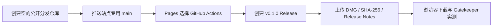
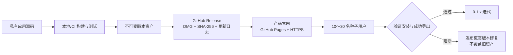
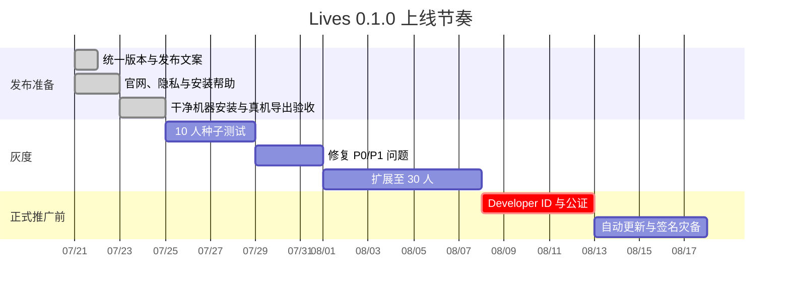

# Lives 0.1.0 独立分发上线计划

> 报告日期：2026-07-22
>
> 发布定位：Apple Silicon Mac 的独立分发预览版
>
> 适用范围：官网分发，不上 Mac App Store，当前尚无 Apple Developer Program

## 一页结论

Lives 已具备小规模种子测试的产品基础，但当前安装包只有 ad-hoc 签名、未经过 Apple 公证。因此 0.1.0 应定位为 **“独立分发预览版”**，先面向 10～30 名了解风险并愿意反馈的用户；在公开推广、收费或启用应用内更新前，建议加入 Apple Developer Program，取得 Developer ID 并完成公证。

当前公开首版统一使用 `0.1.0`。此前 `0.1.13`、`0.1.20` 均视为内部构建，不进入公开更新链；主应用、Tauri、Cargo 与照片 Helper 的版本必须同步。

| 维度 | 0.1.0 状态 | 上线判断 |
| --- | --- | --- |
| 核心功能 | 本地选段、拼贴、关键帧、声音与 Live Photo 导出已实现 | 可灰度 |
| 隐私 | 本机处理；照片权限为 add-only；无账号、广告或分析 | 良好 |
| 系统支持 | Apple Silicon、macOS 13 Ventura 或更高正式版本 | 官网必须明示；不支持 Beta/开发者预览版 |
| 代码签名 | ad-hoc | 仅适合预览版 |
| Apple 公证 | 未配置 | 普通用户安装阻力高 |
| 自动更新 | 未配置 | 0.1.0 采用手动下载安装 |
| Intel Mac | 暂不支持 | 官网不可模糊表述 |
| 软件著作权 | 尚未登记 | 非上线前置，可并行办理 |

## 当前发布状态（2026-07-22）

- 官网源码、GitHub Pages 工作流、隐私说明、使用条款和安装帮助均已完成，并已从应用源码中拆分为独立的 `public-site-main` 分支。
- `Lives_0.1.0_aarch64.dmg`、SHA-256 和发布说明均已生成；本地测试、代码签名完整性检查与 DMG 校验已通过。
- 目标仓库统一为 `ohmyangboy/lives`，作为官网、Issue 模板与 Release 的公开分发仓库。
- 为避免误公开应用源码，只通过 `publish` 专用远端推送站点分支 `public-site-main:main`，不推送本地应用源码分支。
- GitHub Pages 已发布至 `https://ohmyangboy.github.io/lives/`；`v0.1.0` Release 已发布至 `https://github.com/ohmyangboy/lives/releases/tag/v0.1.0`。
- 线上 DMG 已重新下载，SHA-256、文件大小、磁盘映像校验和逐字节比对均通过。
- GitHub Actions `macos-15` M1/arm64 runner 已对线上 DMG 完成三路带音频拼贴、Live Photo 配对验证与 JPG/MOV 文件夹导出；[运行 29884820230](https://github.com/ohmyangboy/lives/actions/runs/29884820230) 成功。
- 发布负责人于 2026-07-22 确认：正式版 macOS 真机的浏览器 quarantine/Gatekeeper、安装启动和“保存到照片”验收通过。iPhone/iCloud 展示为可选扩展验收，不阻塞 0.1.0 邀请制分发。

发布链路如下：



## 分发架构



### 仓库边界

- 应用源码保持私有，不为了 GitHub Pages 将主项目直接公开。
- 官网只包含静态页面、公开图片和公开法律文本。
- 安装包放 GitHub Releases，不把 DMG 提交到 Git 历史或 Pages 仓库。
- 每个 Release 资产永久保留；修复使用更高版本，不替换同名文件。

## 用户看到的发布页

下载按钮旁必须同时出现：

> Apple 芯片 Mac · macOS 13 Ventura 或更高正式版本 · 暂不支持 macOS Beta
>
> Lives 0.1.0 独立分发预览版 · 尚未经过 Apple 公证

风险说明建议使用：

> Lives 当前是独立分发预览版，尚未经过 Apple 公证。macOS 首次打开时可能提示无法验证开发者。请只从 Lives 官方页面下载，并在确认版本和 SHA-256 校验值一致后，按照 Apple 官方说明决定是否打开。

安装帮助只采用 Apple 官方安全流程：先尝试打开，再根据系统提示前往“系统设置 → 隐私与安全性”处理。不得要求用户关闭 Gatekeeper，不提供 `xattr`、`spctl --master-disable` 等绕过命令。

## 发布节奏



### 阶段 A：发布候选（现在）

- 统一 `0.1.0` 版本与 Bundle ID。
- 通过前端、Swift、Tauri 构建和真机 Live Photo 验收。
- 生成 `Lives_0.1.0_aarch64.dmg`、SHA-256 与发布说明。
- 使用一个全新 macOS 用户账户，从浏览器真实下载后验证 quarantine/Gatekeeper 流程。
- 官网发布产品、隐私、安装帮助、更新日志和反馈入口。

### 阶段 B：10～30 人灰度

- 第一批 10 人优先覆盖 macOS 13/14/15、不同 Apple 芯片与是否启用 iCloud 照片。
- 只收集用户主动提交的反馈，不在 0.1.0 静默加入遥测。
- 核心指标：成功安装率、首次成功导出率、完成首张作品所需时间、因 Gatekeeper 放弃率。
- 阻断问题使用更高版本修复，例如 `0.1.1`；不要用旧版本号回滚。

### 阶段 C：公开推广或收费前

- 加入 Apple Developer Program。
- 申请 Developer ID Application 证书，为主应用、Helper、sidecar 和嵌套可执行文件完整签名。
- 启用 Hardened Runtime、安全时间戳，提交公证并 staple ticket。
- 接入 Tauri Updater；更新签名私钥放密码管理器和离线备份，CI 只通过 Secret 注入。
- 决定是否提供 Intel 或 Universal 构建。

## 中国大陆合规与版本保护

### 软件著作权

软件著作权自软件开发完成时产生，登记不是发布前置审批，但登记证书可以作为权属的初步证明。建议在 0.1.0 功能冻结后并行申请。

准备清单：

- 明确著作权人为个人还是公司，先处理雇佣、合作、外包与素材授权关系。
- 保存 Git 历史、PRD、设计稿、构建日志、发布包哈希和首发网页快照。
- 准备登记申请表、身份证明、程序鉴别材料和一种文档。
- 常规鉴别材料为源程序和文档前后各连续 30 页；不足 60 页提交全部，机密部分按登记办法处理。
- 发布版本加版权声明：`Copyright © 2026 ohmyangboy. All rights reserved.`

建议登记名称统一为 `Lives 实况拼贴软件 V0.1.0`，确保申请表、源代码页眉、说明书、截图和安装包完全一致。法定审查时限为受理后 60 日；补正与受理前等待不计入。计算机软件著作权登记行政事业性收费已停征，代理、材料整理或加急属于市场服务费，不是官方登记费。

软著保护的是代码表达，不垄断功能思路、操作方法或算法概念。版本保护还应依靠私有源码、稳定签名身份、不可变 Release、哈希、Git tag 与发布存档共同完成。

### 网站备案判断

- 使用 GitHub Pages 等境外托管时，不因该托管本身办理中国大陆 ICP 备案；但访问速度和稳定性可能波动。
- 如果迁移到中国大陆服务器提供网站，应在上线前通过接入商办理非经营性 ICP 备案，并按适用要求评估公安联网备案。
- 官网仅提供静态介绍与下载、且不收集账号或表单信息时，个人信息处理范围最小；一旦加入邮件订阅、分析、崩溃上报或账号体系，必须同步更新隐私政策与同意机制。

大陆服务器的标准顺序为：域名实名与主体一致 → 购买可备案大陆节点 → ICP 备案（材料齐全时法定 20 个工作日）→ 网站上线 → 正式联网后 30 日内完成公安联网备案并展示编号。GitHub Pages 会为安全和运行记录访问 IP 等日志，官网隐私页需要披露第三方托管。

> 本节为产品上线准备建议，不构成法律意见；正式收费、公司化经营或引入用户数据前，应让合格专业人士复核。

### 品牌与渠道

- 在公开推广前检索“Lives”相关类别商标、域名、GitHub 组织名和主流社交账号，避免只依赖产品名自然使用。
- 官网固定一个官方来源，所有渠道只链接到该域名或 GitHub Release。
- 不使用“Apple 认证”“Apple 官方”等易造成背书误解的表达。
- 首批渠道以熟人、摄影/Live Photo 兴趣群和定向邀请为主，不进行信息流投放。

`Lives` 属于常见英文词，显著性偏弱。建议优先检索并评估第 9 类（可下载软件）、第 42 类（软件服务）以及图形标识；同时保留 `.com`、`.cn`、官方邮件域名和社交账号。`Live Photos` 是 Apple 商标，网站应声明：`Live Photos is a trademark of Apple Inc. Lives is an independent application and is not affiliated with or endorsed by Apple Inc.`

### 第三方依赖

- 发布仓库和官网保留开源软件声明，列出 React、Tauri、Tauri Plugins、Serde 等主要运行时依赖及许可。
- 依赖版本由 lockfile 固定；每次升级依赖都要同步更新声明并检查新增许可义务。
- 0.1.0 已生成根目录 `THIRD_PARTY_NOTICES.md` 和官网“开源声明”页面。正式收费或大规模公开推广前，应再使用自动化工具生成完整的传递依赖许可清单并经人工复核。

## 隐私基线

官网隐私页至少明确：

1. 视频、图片和拼贴处理均在 Mac 本机完成。
2. Lives 不上传、复制或修改原视频，素材库保存的是原文件引用。
3. 保存到“照片”时只请求添加照片权限，不读取或浏览现有图库。
4. 导出到文件夹只写入用户主动选择的位置。
5. 临时文件在成功、失败或取消后清理。
6. 0.1.0 没有账号、广告、行为分析或静默崩溃上报。

系统权限文案保持简短：

> Lives 仅将你生成的 Live Photo 添加到“照片”，不会读取或浏览现有照片。

授权期限等补充信息放在权限请求前的信息浮层中，而不是塞进系统弹窗目的字符串。

## 发布资产与验收

每个公开版本应包含：

```text
Lives_0.1.0_aarch64.dmg
Lives_0.1.0_aarch64.dmg.sha256
release-notes.md
```

启用 updater 后再增加：

```text
Lives.app.tar.gz
Lives.app.tar.gz.sig
latest.json
```

### P0 发布门槛

- [x] 主应用、Tauri、Cargo 与 Helper 统一为 0.1.0。
- [x] 照片权限使用 add-only。
- [x] 官网明确本机处理和原文件引用。
- [x] 前端 15 项测试、Swift 13 项测试通过（1 项依赖外部 Live Photo fixture 的集成测试按设计跳过）。
- [x] `Lives_0.1.0_aarch64.dmg` 已生成（约 4.1 MB），SHA-256 为 `ea6dba1f4e54c55949c5afe0d0c8d994efa6f9f8cb871bcfebf068741a357d2c`。
- [x] 0.1.0 `.app` 已生成，主应用与照片 Helper 版本一致；`codesign --verify --deep --strict` 通过。
- [x] `hdiutil verify` 通过。
- [x] 从浏览器下载后的 Gatekeeper 流程已由发布负责人在正式版 macOS 真机实测并确认通过（2026-07-22；未要求归档包含本机信息的截图）。
- [x] Apple“照片”的授权、写入与展示已由发布负责人在正式版 macOS 真机确认通过；iPhone/iCloud 为非阻塞可选验收。
- [x] 官网、隐私页、安装帮助、版本与 SHA-256 已公开。
- [x] Git tag `v0.1.0` 与 Release 创建完成。

## 参考来源

- [Apple：Distribution](https://developer.apple.com/documentation/technologyoverviews/distribution)
- [Apple：Developer ID](https://developer.apple.com/support/developer-id/)
- [Apple：Notarizing macOS software](https://developer.apple.com/documentation/security/notarizing-macos-software-before-distribution)
- [Apple：安全地打开 Mac 上的 App](https://support.apple.com/102445)
- [Apple：会员方案比较](https://developer.apple.com/support/compare-memberships/)
- [Tauri：macOS Code Signing](https://v2.tauri.app/distribute/sign/macos/)
- [Tauri：Updater](https://v2.tauri.app/plugin/updater/)
- [GitHub：About Releases](https://docs.github.com/en/repositories/releasing-projects-on-github/about-releases)
- [GitHub：配置 Pages 发布源](https://docs.github.com/en/pages/getting-started-with-github-pages/configuring-a-publishing-source-for-your-github-pages-site)
- [国家版权局：《计算机软件著作权登记办法》](https://www.ncac.gov.cn/xxfb/flfg/bmgz/202410/t20241015_869486.html)
- [国家发改委：停征软件著作权登记费（财税〔2017〕20号）](https://www.ndrc.gov.cn/xwdt/ztzl/gbmjcbzc/czb/201807/t20180704_1209082_ext.html)
- [工业和信息化部：非经营性互联网信息服务备案](https://ythzxfw.miit.gov.cn/bssx/alx/dxhhlw/art/2025/art_88c400fc83904008bcf5b11bc08ec18f.html)
- [国家网信办：计算机信息网络国际联网安全保护管理办法](https://www.cac.gov.cn/2014-10/08/c_1112737294.htm)
- [中央网信办：《中华人民共和国个人信息保护法》](https://www.cac.gov.cn/2021-08/20/c_1631050028355286.htm)
- [Apple：商标清单与第三方使用准则](https://www.apple.com/legal/intellectual-property/trademark/appletmlist.html)
