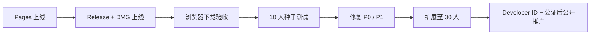

# Lives 0.1.0 最终部署操作卡

> 执行状态（2026-07-22）：仓库、Pages、Release、反馈入口和线上下载校验均已完成。应用源码未上传到公开仓库；第 5 节中的真机安装与导出仍需人工验收。

## 0. 发布物

| 发布物 | 位置 / 值 |
| --- | --- |
| 官网专用分支 | `public-site-main` |
| DMG | `release/v0.1.0/Lives_0.1.0_aarch64.dmg` |
| SHA-256 文件 | `release/v0.1.0/Lives_0.1.0_aarch64.dmg.sha256` |
| Release Notes | `release/v0.1.0/release-notes.md` |
| DMG SHA-256 | `ea6dba1f4e54c55949c5afe0d0c8d994efa6f9f8cb871bcfebf068741a357d2c` |
| 公开仓库 | `https://github.com/ohmyangboy/lives` |
| 产品官网 | `https://ohmyangboy.github.io/lives/` |
| v0.1.0 Release | `https://github.com/ohmyangboy/lives/releases/tag/v0.1.0` |

## 1. 分发仓库

目标仓库：`ohmyangboy/lives`

该仓库是空的公开分发仓库，只用于官网、Issue 模板与 Release；本地应用源码仓库继续保持独立。发布时使用名为 `publish` 的专用远端，不修改现有 `origin`。

## 2. 推送官网（已完成，不会推送应用源码）

确认当前目录为本项目后执行：

```bash
git push publish public-site-main:main
```

这条命令只推送从 `website/` 拆分出的站点历史。不要执行 `git push publish main`，因为本地 `main` 包含应用源码。

## 3. 打开 GitHub Pages（已完成）

1. 打开仓库 **Settings → Pages**。
2. 在 **Build and deployment** 将 Source 设为 **GitHub Actions**。
3. 进入 **Actions**，确认 `Deploy Lives website to Pages` 成功。
4. 打开 Actions 给出的 Pages URL，检查首页、隐私说明、使用条款、开源声明和安装帮助。

## 4. 创建版本冻结 Release（已完成）

1. 进入仓库 **Releases → Draft a new release**。
2. 新建 tag：`v0.1.0`，标题：`Lives 0.1.0 — 独立分发预览版`。
3. 粘贴 `release/v0.1.0/release-notes.md` 的正文。
4. 上传以下两个文件：
   - `Lives_0.1.0_aarch64.dmg`
   - `Lives_0.1.0_aarch64.dmg.sha256`
5. 勾选 **Set as the latest release**，发布 Release。
6. GitHub 当前显示该 Release 的 `isImmutable=false`，因此“不可变”由发布纪律保证：不要覆盖同名资产；任何修复都使用 `0.1.1` 或更高版本。

## 5. 发布后验收

- [x] 从 Pages 官网点击下载按钮，能进入最新 Release。
- [x] 从线上 Release 重新下载 DMG，不使用本机构建目录中的文件。
- 在终端核对：

```bash
shasum -a 256 ~/Downloads/Lives_0.1.0_aarch64.dmg
```

- [x] 输出与本卡顶部 SHA-256 完全一致，且线上文件与本地冻结发布物逐字节相同。
- [ ] 在运行正式版 macOS 的 Apple Silicon Mac 上打开线上下载的 DMG，把 Lives 拖入“应用程序”。首次启动按 Apple 官方的“隐私与安全性 → 仍要打开”流程完成 Gatekeeper 实测。
- [ ] 在该稳定系统上导入视频，生成一张 Live Photo，分别验证保存到“照片”和导出到文件夹。
- [ ] 若启用 iCloud 照片，再到 iPhone 验证 Live 属性、关键帧和声音。

当前开发机运行 macOS 27 开发测试版 `26A5388g`。系统 `VTCopyVideoEncoderList` 未返回 H.264/HEVC 编码器，FFmpeg VideoToolbox 与 Lives 发布版均无法建立编码会话，因此该系统不能作为 0.1.0 导出验收环境；这不应通过修改或绕过 Gatekeeper 解决。

## 6. 对外发布顺序



0.1.0 尚未经过 Apple Developer ID 签名和公证，因此只建议小规模种子分发。不要投放广告、收费或承诺自动更新。
