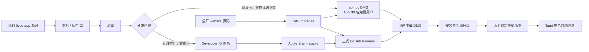
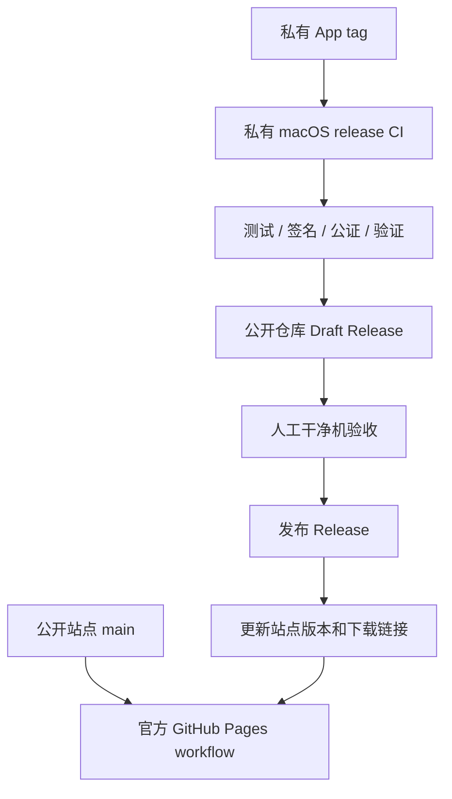

# Lives 独立分发最终计划

> 版本：2026-07-22
>
> 目标：不进入 Mac App Store，通过 GitHub Pages + GitHub Releases 分发 Lives。
>
> 本文已合并并审查：当前工程状态、原《GitHub Pages 独立分发全流程 SOP》与外部补充材料。本文是后续执行的唯一基准；较早文档仅保留为历史参考。
>
> 本文提供工程和产品操作建议，不替代针对实际经营主体、收费模式和数据处理方式的法律或税务意见。

## 0. 最终结论

Lives 采用以下路线：

> **当前选择（2026-07-22）：暂不购买 Apple Developer Program，不进行 Developer ID 签名和 Apple 公证。现阶段只执行阶段 A“零成本邀请制预览”；阶段 B～D 全部延期，直到预算允许。**

1. **核心源码保持私有**；公开仓库只放官网、法律文本、公开文档和 Release 资产。
2. 当前 `0.1.0` 可以作为 **Apple Silicon、macOS 13+ 正式版本、未公证、无自动更新** 的邀请制预览版，最多先给 10～30 名知情用户；macOS Beta 或开发者预览版不在支持范围内。
3. 如果目标是通过官网面向普通用户公开推广，建议直接加入每年 99 美元的 Apple Developer Program，完成 **Developer ID Application 签名 + Hardened Runtime + Apple 公证 + staple**，不要把 ad-hoc 版本当作长期公开方案。
4. **自动更新不是 0.1.0 首发项。** 先让签名、公证、手动 DMG 升级连续稳定两个版本，再接入 Tauri Updater。
5. 不提供 `sudo xattr`、关闭 Gatekeeper 或其他解除系统保护的命令；未公证版只引用 Apple 官方“系统设置 → 隐私与安全性 → 仍要打开”流程。
6. 不使用 `ghfast.top` 等非受控免费代理作为官方镜像。中国大陆访问问题先测量；确有需求后，再使用自己控制且完成必要备案评估的对象存储/CDN。
7. 软件著作权不是 GitHub 直发的前置审批，但建议与小范围测试并行准备，不能表述为“完全不需要”。
8. 首发反馈使用 GitHub Issues + 专用支持邮箱；日志必须本地、脱敏、由用户预览后主动导出，不自动上传视频、文件路径或照片信息。



## 1. 外部补充材料审查结果

| 补充材料观点 | 审查结论 | 最终采用方式 |
| --- | --- | --- |
| GitHub Pages + Releases 适合低成本分发 | 正确 | 保留，但拆分私有源码仓库与公开分发仓库。 |
| 闭源时不放开源许可证 | 基本正确 | 源码私有；官网明确 `All Rights Reserved`，同时履行第三方许可证义务。 |
| “软著完全不需要” | 表述过度 | 不是首发前置，但对权属举证、合作和未来国内平台可能有价值，并行办理。 |
| Developer ID + 公证后“无任何弹窗” | 错误 | Gatekeeper 能识别开发者和公证状态，但从网络下载的 App 首次打开仍通常要求用户确认；照片权限也会单独询问。 |
| ad-hoc 版本让用户运行 `sudo xattr` | **拒绝** | 只采用 Apple 官方 Open Anyway 流程，不要求用户执行终端绕过命令。 |
| 0 成本首发同时配置自动更新 | 不适合 Lives 当前阶段 | updater 技术上有独立签名，但不能替代 Apple 代码签名和公证；正式签名稳定后再启用。 |
| Tauri updater 公私钥、`.sig`、`latest.json` | 概念正确 | 后置实施；密钥双备份，客户端只嵌公钥，私钥只进入受控发布环境。 |
| `latest.json` 放 GitHub Pages | 可行但非首选 | 优先使用 GitHub Release 的稳定 HTTPS endpoint；上传完整产物后最后发布 manifest。 |
| 同时声明 `darwin-aarch64` 与 `darwin-x86_64` | 当前错误 | 现在只发布 `darwin-aarch64`。当前 Swift sidecar/Helper 只构建 arm64，不能虚构 Intel 支持。 |
| `tauri-action@v2` + `peaceiris/actions-gh-pages@v3` 示例 | 不应复制 | 与当前官方 action、双仓库权限和已有 Pages 工作流不一致；实施时使用官方 action，并固定到已审查的 commit SHA。 |
| 单个 workflow 同时构建私有 App、发公开 Release、部署 Pages | 当前架构不成立 | `GITHUB_TOKEN` 默认只作用于当前仓库。首发手工上传；自动化时使用最小权限 GitHub App 或 fine-grained token 跨仓库发布。 |
| 免费 GitHub CDN 代理 | **拒绝** | 初始安装包属于供应链入口，不能交给不受控代理。 |
| GitHub Issues 与本地日志导出 | 正确 | 采用，但增加脱敏、用户预览、私密安全邮箱和数据保留规则。 |

Apple 明确说明，即使是已识别开发者，从网络下载的软件第一次打开时 macOS 仍会请求用户确认；未签名或未公证软件应只按 Apple 官方路径临时允许打开。[Apple：安全地打开 Mac App](https://support.apple.com/102445)

## 2. 当前工程状态与阻塞项

### 2.1 已具备

- 产品版本已统一为 `0.1.0`。
- 已产出 `Lives_0.1.0_aarch64.dmg`，大小约 4.1 MB。
- 当前 DMG SHA-256：`ea6dba1f4e54c55949c5afe0d0c8d994efa6f9f8cb871bcfebf068741a357d2c`。
- 官网已具备首页、隐私说明、使用条款、第三方软件声明和 GitHub Pages 官方 Actions 工作流。
- 目标平台已经明确为 Apple Silicon、macOS 13 Ventura 或更高的正式版本；macOS Beta 或开发者预览版不在 0.1.0 支持范围内。
- App 使用本地处理模式；照片权限为 add-only；无账号、行为分析和自动崩溃上报。
- Git 分支已有 `public-site-main`，可只推官网历史，避免公开应用源码。
- 公开分发仓库已固定为 `ohmyangboy/lives`，产品官网已发布至 `https://ohmyangboy.github.io/lives/`。
- `v0.1.0` Release、DMG 与 SHA-256 已发布；线上 DMG 重新下载后的哈希、文件大小、磁盘映像校验和逐字节比对均通过。
- 运营者/版权主体已统一为 `ohmyangboy`，支持邮箱为 `ohmyangboy@gmail.com`；Issue 表单已启用并禁止空白 Issue。

### 2.2 正式公开推广前必须解决

1. `src-tauri/tauri.conf.json` 当前使用 `"signingIdentity": "-"`，属于 ad-hoc 签名。
2. `scripts/build-sidecar.sh` 对 `LiveCollagePhotosHelper.app` 使用 `--sign - --timestamp=none`；Helper 与 sidecar 也必须正式签名。
3. Helper 目前是 arm64 thin binary，未启用正式发布所需的 Hardened Runtime 签名流程。
4. 没有 Tauri Updater 插件、更新公钥、更新产物或 release CI。

### 2.3 阶段 A 验收记录

1. [已完成] 发布负责人已在运行正式版 macOS 的 Apple Silicon Mac 上，从浏览器下载线上 DMG、安装到“应用程序”，并按 Apple 官方路径完成 Gatekeeper 首次打开实测（2026-07-22 确认通过）。
2. [已完成] GitHub Actions `macos-15` M1/arm64 runner（macOS 15.7.7，24G720）已重新下载线上 DMG，并通过 SHA-256、DMG、代码签名、三路音频拼贴、Live Photo 元数据、`PHLivePhoto` 配对验证和 JPG/MOV 文件夹导出。[成功运行](https://github.com/ohmyangboy/lives/actions/runs/29884820230)
3. [已完成] 发布负责人已在正式版 macOS 真机上验证“保存到照片”的授权、写入与照片 App 展示（2026-07-22 确认通过）。iPhone/iCloud 展示是非阻塞可选验收。

当前 macOS 27 开发测试版 `26A5388g` 的系统 VideoToolbox 未提供 H.264/HEVC 编码器，不能作为 0.1.0 导出验收环境。

## 3. 决策冻结

| 决策项 | 最终选择 | 重新评估条件 |
| --- | --- | --- |
| 源码策略 | 核心源码私有，官网/公开文档公开 | 明确决定建设开发者社区时再评估 Apache-2.0。 |
| 首发架构 | 仅 Apple Silicon | 用户反馈证明 Intel 需求足够，且 sidecar/Helper 可正确构建并真机测试时。 |
| 最低系统 | macOS 13+ 正式版本 | Beta/开发者预览版不支持；通过完整回归后才能调整。 |
| 分发入口 | 自有域名/GitHub Pages → GitHub Release | 大陆下载数据证明需要受控镜像时。 |
| 0.1.0 更新 | 手动下载 DMG | 不变。不要给已发布预览版中途强塞 updater。 |
| 正式更新 | 当前不接；未来再使用 Tauri Updater | 有会员预算，并且 Developer ID、公证、更新密钥灾备、两个稳定版本均完成。 |
| 反馈 | GitHub Issues + support 邮箱 | 反馈量超过个人维护能力时再引入工单系统。 |
| 遥测 | 默认无遥测、无自动崩溃上传 | 确有定位需要并完成隐私改造、用户选择加入时。 |
| 软著 | 并行准备，不阻塞首发 | 产品名称、版本与权利人冻结后提交。 |
| 收费 | 首发不收费 | 验证需求后另做主体、税务、退款和许可方案。 |

## 4. 仓库与权限架构

### 私有应用仓库 `lives-app`

保存：

- React/Tauri/Swift 源码；
- 构建和测试脚本；
- release workflow；
- 私有发布记录、公证 submission ID、符号文件；
- 不写入 Git 的证书和更新密钥引用。

### 公开分发仓库 `lives-site`

保存：

- `website/` 静态源码；
- 隐私政策、使用条款、第三方声明、FAQ；
- Issue templates、`SECURITY.md`；
- GitHub Releases 的 DMG、SHA-256、release notes；
- 未来的 updater bundle、`.sig`、`latest.json`。

### 权限规则

- GitHub 全员开启 2FA，保存恢复码。
- 公开仓库 `main` 启用 branch protection；Pages 只允许默认分支部署。
- Release workflow 使用 production environment 和人工审批。
- 第三方 GitHub Actions 固定到已审查的完整 commit SHA，而不是长期依赖浮动 tag。
- Apple `.p12`、证书密码、公证凭据、Tauri 更新私钥不得出现在仓库、构建日志、Issue、普通 `.env` 或聊天记录。

## 5. 法律文本与权属

这些文本通常不需要向政府单独申请后才能发布，但必须真实、易于访问，并与软件实际行为一致。文本不能赋予你并不拥有的字体、素材、商标或第三方代码权利，也不能排除法律强制责任。

### 正式发布前需要四个公开页面

1. **隐私政策**：运营者真实姓名/主体、联系方式、处理或不处理的数据、权限、目的、保存期、第三方、用户权利、生效日和版本。
2. **使用条款/EULA**：许可范围、测试版/正式版状态、系统要求、素材权利、更新/停止、反馈、免责边界、适用联系渠道。
3. **第三方软件声明**：完整复核运行时依赖、许可证及必要的版权/NOTICE 文本。
4. **安全与反馈说明**：安全漏洞走私密邮箱；公开 Issue 禁止上传视频、照片、私人路径和未脱敏日志。

### 展示位置

- 官网 footer 常驻链接；
- 下载按钮附近显示系统要求、公证状态、隐私摘要和条款链接；
- App 的“关于/帮助”页提供版本、支持邮箱、隐私和条款链接；
- 新增自动更新、诊断、分析、账号或支付前，先更新政策并按需要取得用户同意；
- 每次重大变更保留旧版本政策归档和生效日期。

### 开源与版权

- 当前核心源码私有：使用 `All Rights Reserved`，不添加会开放核心代码的 MIT/Apache/GPL 许可证。
- 第三方开源依赖仍按各自许可证履行义务；闭源不等于可以忽略 NOTICE。
- 若未来开源：推荐重新评估 Apache-2.0 + 商标/Logo 保留，并增加 `LICENSE`、`NOTICE`、`CONTRIBUTING.md`、DCO/CLA 和 `SECURITY.md`。
- 保存 Git 历史、tag、构建日志、DMG hash、官网快照、设计文件和协作者权属协议。

## 6. 阶段 A：0.1.0 邀请制预览

> 这一阶段可以不购买 Apple Developer Program，但只适合知情种子用户。若你准备立即面向陌生用户宣传，应跳到阶段 B，先买会员并公证。

### A1. 发布资产冻结

资产：

```text
Lives_0.1.0_aarch64.dmg
Lives_0.1.0_aarch64.dmg.sha256
release-notes.md
```

要求：

- 版本、文件名、官网文案和 Release tag 全部为 `0.1.0` / `v0.1.0`。
- 不覆盖同名 Release 资产；修复使用 `0.1.1`。
- Release 明确：Apple Silicon、macOS 13+、ad-hoc、未公证、无自动更新。
- 官网只链接官方 GitHub Release，不增加第三方代理下载按钮。

### A2. 发布前本机验证

```bash
shasum -a 256 release/v0.1.0/Lives_0.1.0_aarch64.dmg
hdiutil verify release/v0.1.0/Lives_0.1.0_aarch64.dmg
codesign --verify --deep --strict --verbose=2 /path/to/Lives.app
```

### A3. 部署官网

1. 确认 `public-site-main` 只含官网源码、工作流和公开文档。
2. 将它推送到公开分发仓库的 `main`；不要执行会推送私有应用 `main` 的命令。
3. 仓库 **Settings → Pages** 选择 GitHub Actions。
4. 配置 `LIVES_VERSION=0.1.0` 与官方 Release 下载 URL。
5. 运行当前 `configure-pages` → `upload-pages-artifact` → `deploy-pages` 工作流。
6. 检查首页、隐私、条款、第三方声明、安装帮助和移动端布局。

当前官方 Pages 流程就是构建静态文件、上传 Pages artifact，再使用 `actions/deploy-pages`；无需替换为补充材料里的第三方 `peaceiris/actions-gh-pages`。[GitHub Pages 自定义工作流](https://docs.github.com/en/pages/getting-started-with-github-pages/configuring-a-publishing-source-for-your-github-pages-site)

### A4. 创建 GitHub Release

1. 创建 tag `v0.1.0` 和 draft Release。
2. 上传 DMG、`.sha256` 和 release notes。
3. 发布后从官网点击下载，不使用本地构建路径。
4. 下载后再次核对 SHA-256。
5. 在新 macOS 用户账户或干净测试机完成真实安装和 Live Photo 导出。

### A5. 未公证版安装说明

官网只写 Apple 官方流程：

1. 用户正常尝试打开 Lives。
2. 如果 macOS 阻止，用户自行确认来源。
3. 打开“系统设置 → 隐私与安全性”，在 Apple 提供该选项时选择“仍要打开”。
4. 再次确认打开。

不得提供：

```text
sudo xattr -rd com.apple.quarantine ...
spctl --master-disable
关闭 Gatekeeper
要求用户关闭 SIP
```

### A6. 灰度验收

- 第一批 10 人覆盖 macOS 13/14/15、不同 Apple 芯片、iCloud 照片开/关。
- 记录：官网下载成功、安装成功、Gatekeeper 放弃、首次导出成功、iPhone Live 属性、关键帧、声音。
- 阻断问题发布更高版本；不修改已发布文件。
- 预览阶段不投广告、不收费、不承诺自动更新。

## 7. 阶段 B：正式独立分发

### B1. Apple 账户

1. 以个人或组织身份加入 Apple Developer Program；当前官方价格为每会员年 99 美元或适用地区本币。
2. 完成身份验证；个人账户使用法定姓名，组织账户需要合法实体和 D-U-N-S 等材料。
3. Account Holder 创建 `Developer ID Application` 证书。
4. 将证书及私钥导出为有密码的 `.p12`，放密码管理器；另做加密离线备份。

免费 Apple Account 不提供 Mac App 的 Developer ID 与公证能力。[Apple 会员方案比较](https://developer.apple.com/support/compare-memberships/)

### B2. 改造 Lives 签名链

签名顺序必须从内到外：

```text
live-photo-service executable
→ LiveCollagePhotosHelper.app
→ Tauri 主 App
→ DMG
→ 公证最外层分发物
→ staple
```

具体工作：

1. 改造 `scripts/build-sidecar.sh`，正式构建时不再写死 `--sign - --timestamp=none`。
2. sidecar 和 Helper 使用 Developer ID、Hardened Runtime、安全时间戳和各自所需最小 entitlements。
3. Tauri 使用环境变量提供 signing identity，避免在仓库硬编码个人证书名称。
4. 确保所有嵌套 Mach-O 都是 arm64 且签名有效；签名后不得再复制或修改 bundle 内容。
5. 检查不存在 `get-task-allow=true`。

### B3. 手工跑通一版公证

第一次不要直接交给 CI。先在受控 Mac 上跑通并保存日志：

```bash
security find-identity -v -p codesigning
codesign --verify --deep --strict --verbose=4 /path/to/Lives.app
xcrun notarytool submit /path/to/Lives.dmg --keychain-profile lives-notary --wait
xcrun stapler staple /path/to/Lives.dmg
xcrun stapler validate /path/to/Lives.dmg
hdiutil verify /path/to/Lives.dmg
spctl --assess --type execute --verbose=4 /path/to/Lives.app
```

必须阅读 notary log，即使状态成功也处理其中警告。Apple 公证要求有效 Developer ID、Hardened Runtime、时间戳和正确签名的所有可执行内容。[Apple：公证 macOS 软件](https://developer.apple.com/documentation/security/notarizing-macos-software-before-distribution)

### B4. 干净环境验收

- 从 GitHub Release 浏览器下载最终 DMG。
- 验证 Developer ID、notarization ticket、staple、DMG 完整性。
- 记录首次打开界面：允许正常的“从互联网下载”确认；不得再出现“无法验证开发者”。
- 验证照片 add-only 权限、保存照片、文件夹导出、失败/取消清理、iPhone/iCloud。
- 公证通过后再更新官网文案，不提前宣称“已公证”。

## 8. 阶段 C：发布自动化

### C1. CI 边界

推荐两条独立流水线：



- 首个正式版本继续手工上传，降低跨仓库密钥复杂度。
- 自动化时，私有源码仓库使用只允许写公开分发仓库 Releases 的 GitHub App 或 fine-grained token；默认 `GITHUB_TOKEN` 不能假定拥有跨仓库写权限。
- 创建 draft Release，所有验证通过且干净机验收后才发布。
- `tauri-action` 的具体版本在实施当天从官方仓库核对，并固定到完整 commit SHA；不要直接复制未经验证的 `@v2` 示例。[Tauri GitHub Action](https://github.com/tauri-apps/tauri-action)
- 当前只构建 `aarch64-apple-darwin`。在 sidecar/Helper 支持 Intel 前，不添加 x86_64 matrix。

### C2. CI 发布门槛

1. tag 必须匹配 App 版本。
2. 校验 `package.json`、`Cargo.toml`、`tauri.conf.json`、Helper version 一致。
3. 运行前端、Rust/Tauri 与 Swift 测试。
4. 构建 arm64 sidecar、Helper、主 App。
5. Developer ID 签名、公证、staple。
6. 执行 `codesign`、`spctl`、`hdiutil` 和 SHA-256 验证。
7. 生成 release notes、第三方许可证清单/SBOM。
8. 上传 draft Release；归档公证 ID、CI run ID、符号文件和 hash。
9. 人工验收后发布，随后部署官网。

## 9. 阶段 D：Tauri 自动更新

### D0. 启用条件

只有同时满足以下条件才开始：

- 至少两个 Developer ID 签名、公证、手动升级成功的版本；
- 更新密钥有密码管理器与加密离线双备份，并实际演练恢复；
- Release CI 可重复生成相同发布链；
- 隐私政策已披露更新检查可能暴露 IP、请求时间、当前版本、架构和 User-Agent；
- App 有“检查更新”、变更日志、下载进度、“稍后安装”和失败回退官网。

### D1. 实施步骤

1. 安装 Tauri v2 updater plugin 与所需 process plugin。
2. 使用项目内 Tauri CLI 生成专用更新密钥：

   ```bash
   npm run tauri signer generate -- -w /secure/path/lives-updater.key
   ```

3. 私钥及密码只进入 production secrets；公钥写入 `tauri.conf.json`。
4. 开启 `bundle.createUpdaterArtifacts: true`；macOS 生成 `.app.tar.gz` 和 `.sig`。
5. endpoint 使用 HTTPS，优先：

   ```text
   https://github.com/<owner>/<distribution-repo>/releases/latest/download/latest.json
   ```

6. stable 与 beta 使用不同 manifest/发布渠道，避免 prerelease 污染 stable。
7. 客户端先展示更新内容，由用户确认下载和重启；第一版不做静默安装。

Tauri 强制验证更新签名，不能关闭；公钥可公开，私钥不能共享或遗失。[Tauri Updater](https://v2.tauri.app/plugin/updater/)

### D2. `latest.json` 最小格式

Lives 当前只写 arm64：

```json
{
  "version": "0.2.1",
  "notes": "修复导出失败并改善兼容性。",
  "pub_date": "2026-08-01T08:00:00Z",
  "platforms": {
    "darwin-aarch64": {
      "url": "https://github.com/<owner>/<repo>/releases/download/v0.2.1/Lives.app.tar.gz",
      "signature": "<.sig 文件的完整内容>"
    }
  }
}
```

规则：

- `version` 必须是有效 SemVer，Tauri 接受有或无前导 `v`；团队统一不用 `v`，Git tag 使用 `v0.2.1`。
- `signature` 是 `.sig` 文件内容，不是 URL。
- Tauri 会验证整个 JSON，不能放未完成的 Intel platform。
- 发布顺序：签名公证 App → 上传 updater bundle 和 `.sig` → 验证下载 → **最后**上传/切换 `latest.json`。
- Tauri updater 签名不能替代 Apple Developer ID 签名与公证。

## 10. 反馈、日志与安全响应

### 公开 Issue templates

- Bug：App 版本、macOS、芯片、步骤、预期、实际、是否稳定复现。
- 安装问题：下载来源、错误文字、公证版本、是否为受管理设备。
- 功能建议：使用场景、当前替代方案、价值，不要求用户提供原始媒体。

模板必须提示：

> 不要上传私人视频、照片、完整文件路径、Apple ID、联系方式或未经脱敏的日志。公开 Issue 会被所有人看到，并由 GitHub 托管处理。

### 私密渠道

- `support@产品域名`：隐私问题和无法公开的支持请求。
- `security@产品域名` 或同一邮箱的安全别名：漏洞、签名冒用、恶意安装包。
- 安全问题 24 小时内确认收到，72 小时内提供初步风险判断；这不是修复完成承诺。

### 本地诊断

- 日志按大小/时间轮转，默认不记录视频文件名、完整路径、照片 identifier、画面内容、EXIF/GPS、token。
- App 提供“复制诊断信息/导出诊断包”，先让用户预览，再由用户主动保存或提交。
- 不直接把前端所有 `console`、Swift stderr 或用户素材信息无筛选写进同一个日志。
- 每个 Release 私下保存匹配的 dSYM/符号文件，否则 crash report 难以符号化。
- 首发不接 Sentry 等自动上报；以后接入时先更新隐私政策并提供 opt-in。

## 11. 中国大陆、软著与商业化

### 中国大陆下载

- GitHub Pages/Releases 可以作为首发源，但不承诺中国大陆可用率或速度。
- 上线前从电信、联通、移动和至少三个地区测试首页、Release、完整下载和 hash。
- 不使用无法控制、无法审计、可能替换内容的第三方免费代理。
- 需要国内镜像时：确定个人/公司主体 → 域名实名 → 向云服务商/属地主管部门确认 ICP 与 APP 备案适用性 → 选择 OSS/COS 等受控存储/CDN → 上传与 GitHub Release 完全相同的签名公证资产 → 比对相同 SHA-256。
- updater 不自动轮换到未知镜像；新增 endpoint 必须 HTTPS、受控且保持 Tauri 签名验证。

### 软件著作权

- 不阻塞 GitHub 预览和 Apple 公证。
- 产品名、版本、权利人冻结后并行办理。
- 准备申请表、身份证明、权属材料、源程序和文档鉴别材料。
- 常规鉴别材料为源程序和一种文档前后各连续 30 页；不足 60 页提交全部；受理后法定审查期为 60 日。[国家版权局《计算机软件著作权登记办法》](https://www.ncac.gov.cn/xxfb/flfg/bmgz/202410/P020241015604759788122.pdf)

### 商业化触发条件

开始收费、订阅、许可证服务器、账号或云同步前，单独完成：

- 经营主体、税务、发票和退款规则；
- 付费条款和消费者权益复核；
- 商标第 9 类/相关类别检索与申请评估；
- 隐私政策、第三方服务、跨境处理和数据保留方案；
- 许可证密钥恢复、停服和离线使用策略。

## 12. 最终执行时间表

### 立即：今天完成决策

- [x] 已决定仅做 10～30 人零成本预览，暂不申请 Apple Developer Program。
- [x] 确认源码私有、公开分发仓库独立。
- [x] 确认运营者/版权主体为 `ohmyangboy`，support 邮箱为 `ohmyangboy@gmail.com`。
- [x] 禁止官网出现 `xattr`、关闭 Gatekeeper、第三方代理下载。

### 阶段 A：1～2 天

- [x] 完成隐私/条款/第三方声明补充。
- [x] 配置 Issue templates、`SECURITY.md` 和支持邮箱。
- [x] 验证 0.1.0 DMG/hash/release notes。
- [x] 推送公开官网并发布 `v0.1.0` Release。
- [x] 浏览器重新下载并完成正式版 macOS 真机验收。
- [ ] 邀请首批 10 人，不启用 updater。

### 阶段 B：Apple 账号通过后 3～7 天

> 当前状态：延期；预算允许并加入 Apple Developer Program 后再启动。

- [ ] 创建 Developer ID Application 证书与密钥备份。
- [ ] 改造 sidecar/Helper/Tauri 完整签名链。
- [ ] 手工跑通 Hardened Runtime、时间戳、公证、staple。
- [ ] 干净环境再次验证并发布更高版本，不替换 0.1.0。
- [ ] 扩到 30 人，验证两个稳定签名版本。

### 阶段 C：签名链稳定后 3～5 天

> 当前状态：延期。

- [ ] 建立私有 release CI 和公开 draft Release 发布权限。
- [ ] 加入版本一致性、测试、签名、公证、hash、SBOM 门禁。
- [ ] 归档符号文件、公证 ID 和构建记录。

### 阶段 D：两个正式版本稳定后 3～5 天

> 当前状态：延期。

- [ ] 生成并双备份 updater 私钥。
- [ ] 接入 updater plugin、arm64 updater bundle、`.sig`、`latest.json`。
- [ ] 建 beta/stable 渠道和用户确认界面。
- [ ] 演练错误更新、私钥丢失、GitHub 不可用和手动回退。

时间是工程估算，不包含 Apple 账号审核、证书审批、域名 DNS 或中国备案等待时间。

## 13. 每版发布门禁

### 发布前

- [ ] 版本、tag、Bundle ID、Helper、官网一致。
- [ ] 系统要求和支持架构准确。
- [ ] 前端、Swift、Rust/Tauri 测试通过。
- [ ] 依赖许可与安全公告复核。
- [ ] 主 App、sidecar、Helper 签名完整。
- [ ] 正式版公证、staple、Gatekeeper 评估通过。
- [ ] DMG、SHA-256、release notes、第三方声明齐全。
- [ ] updater 版本同时有完整 bundle、`.sig` 和 manifest。
- [ ] 干净机器从浏览器下载验收。
- [ ] 无私钥、证书、token、用户媒体和隐私日志泄露。

### 发布后 48 小时

- [ ] 官网、HTTPS、Release、hash 和下载链接正常。
- [ ] 监看 Issues、邮箱和安全报告。
- [ ] P0 时先暂停下载/公告，再发布更高修复版本。
- [ ] 不替换旧二进制、不下调版本号。
- [ ] 记录安装、首次导出、更新和放弃原因。

## 14. 参考来源

- [Apple：Developer ID](https://developer.apple.com/support/developer-id/)
- [Apple：会员方案比较](https://developer.apple.com/support/compare-memberships/)
- [Apple：公证 macOS 软件](https://developer.apple.com/documentation/security/notarizing-macos-software-before-distribution)
- [Apple：安全地打开 Mac App](https://support.apple.com/102445)
- [Tauri：macOS Code Signing](https://v2.tauri.app/distribute/sign/macos/)
- [Tauri：Updater](https://v2.tauri.app/plugin/updater/)
- [Tauri：GitHub Action](https://github.com/tauri-apps/tauri-action)
- [GitHub：Pages 自定义工作流](https://docs.github.com/en/pages/getting-started-with-github-pages/configuring-a-publishing-source-for-your-github-pages-site)
- [GitHub：Releases](https://docs.github.com/en/repositories/releasing-projects-on-github/about-releases)
- [国家版权局：计算机软件著作权登记办法](https://www.ncac.gov.cn/xxfb/flfg/bmgz/202410/P020241015604759788122.pdf)

---

## 附录：与旧文档关系

本文件取代以下执行性结论：

- `GitHub-Pages-独立分发全流程-SOP.md`
- `Lives-0.1.0-上线计划.md`
- 外部补充材料 `pasted-text.txt`

`Lives-0.1.0-最终部署操作卡.md` 仍可作为 0.1.0 的手工部署快捷卡，但遇到冲突时以本文为准。
